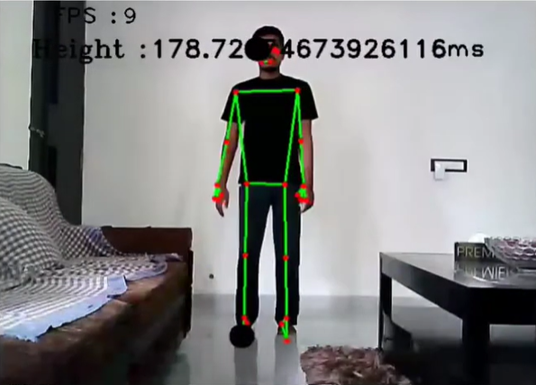

# Height Detection Model 📏

## Overview

"Height Detection Model" is an application that leverages computer vision and pose estimation technologies to measure human height using a standard webcam. This project combines OpenCV for image processing and MediaPipe for accurate pose estimation, providing a non-intrusive way to measure height digitally.
<div align="center">
  
</div>

 **To estimate distance and set a calibration factor, a depth estimation model must be used** 
**In this case, we are using  [Depth-anything](https://huggingface.co/LiheYoung/depth-anything-small-hf),  an open-source Hugging Face model.**

<div align="center">
  
</div


## Features

- Real-time height measurement using a webcam.
- Automated voice instructions for user guidance.
- Calibration using a reference image with a known distance.

## Demo

Check out the demonstration of the project on YouTube to see how it works in action:          [Output Video](https://www.youtube.com/watch?v=TGIpzLwkKLk).


## Prerequisites

Ensure your system meets the following requirements:

- Python 3.x
- Webcam or any standard camera compatible with OpenCV.

## Installation

### Clone the Repository

```bash
git clone https://github.com/zamalali/Height-Detection.git
cd Height-Detection
```

### Setup

Before running the application, you need to capture a reference image (`Ref_image.jpg`) of a person standing at a known distance from the camera. This image is crucial for the algorithm to calibrate and accurately measure heights by comparison.

- **Capture Reference Image**: Take a photo of a person standing at a precisely measured distance from the camera. Ensure the full body is visible and positioned centrally in the frame.
- **Save Reference Image**: Name this image `Ref_image.jpg` and save it in the project directory.

## Usage

To start the application, run the `ex.py` script:

```bash
python ex.py
```


